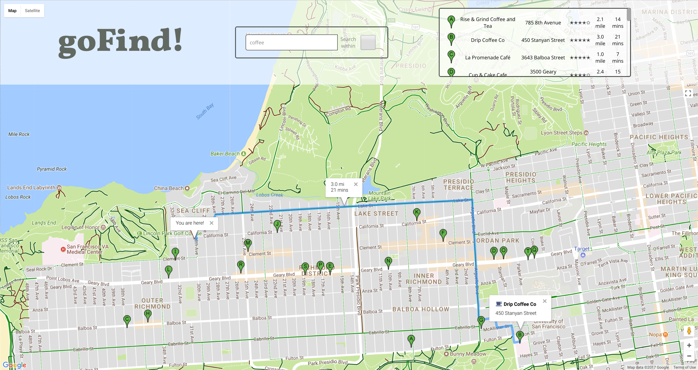

# goFind!

[Live](https://younis.site/gofind/)

goFind! is a single page web app developed using React.js, Google Maps JavaScript API, Google Places API, Google Distance Matrix API, and Google Directions API.



## Libraries

* React

## APIs

* Google Maps JavaScript API.
* Google Places API.
* Google Distance Matrix API.
* Google Directions API.

## Features & Implementation

### Identify the user's location

Upon visiting the website, the user is greeted with an access location request, once granted the map zooms to the user current location and an infowindow pops up allerting them of the current location.

The Map is initially initialized centered somewhere in the North Atlantic Ocean.

If the user choose not to share his current location or the broweser doesn't support Geolocation. They are immediately prombted that the Geolocation failed and they still has the option to navigate manually to wherever they would like, to search for places.

```js
if (navigator.geolocation) {
        navigator.geolocation.getCurrentPosition(function (position) {
          pos = {
            lat: position.coords.latitude,
            lng: position.coords.longitude
          };

          initialInfoWindow.setPosition(pos);
          initialInfoWindow.setContent('You are here!');
          initialInfoWindow.open(map);
          map.setCenter(pos);
          map.setZoom(15);
          var marker = new google.maps.Marker({
            position: pos,
            map: map
          });
        }, function () {
          handleLocationError(true, initialInfoWindow, map.getCenter());
        });
      } else {
        handleLocationError(false, initialInfoWindow, map.getCenter());
      }
      google.maps.event.trigger(map, "resize");
    }
```

### Search for Establishments

Users can search for establishments using the search box. If the user doesn't choose a place from the autocomplete featured list and hits enter, The establishment is requested from Google Places API.

Upon completetion of the search, a hidden div element pops up inside the navogation top bar with an alphabitized list of the results. The same list is represented on the map with alphabitized markers.

The search is done for a radius of the 500 meters from the center of the map and also including the viewport bounds. The search is inclusive of all places that have the input in their name or in their keywords.

```js
if (!place.geometry) {
  infowindow2.close();
  directionsDisplay.setDirections({ routes: [] });
  directionsDisplay.setMap(map);
  let request = {
    location: map.center,
    radius: '500',
    query: input.value,
    keyword: input.value,
    bounds: map.getBounds(),
  };
  that.service = new google.maps.places.PlacesService(map);
```

There is integrated interaction between the map and the list. If a marker is clicked or a list item is clicked a route starting at the users current location showing the biking route to the clicked location. An infowindow in the center of the longest routes' leg pops up with the current travel time and distance (biking), another infowindow pops up at the location, showing the name and address. If the user didn't agreed to share their cureent location, or the browser doesn't support it, clicking on a list item, or a marker, will result is only the inforwindow for the place showing the previously mentioned information.

The distances and travle times are calculated using Google Distance Matrix API.

```js
service.getDistanceMatrix(
  {
    origins: [pos],
    destinations: [
      new google.maps.LatLng(results[i].geometry.location.lat(), results[i].geometry.location.lng()),
    ],
    travelMode: 'BICYCLING',
    drivingOptions: DrivingOptions,
    unitSystem: google.maps.UnitSystem.Imperical,
    // duration_in_traffic: true,
    avoidHighways: false,
    avoidTolls: false,
  },
  response_data,
);
```

The routes are caluclated using Google Directions Service API.

```js
directionsService.route(
  {
    origin: pos,
    destination: new google.maps.LatLng(
      marker.placeResult.geometry.location.lat(),
      marker.placeResult.geometry.location.lng(),
    ),
    travelMode: 'BICYCLING',
  },
```

The infowindow showing the travel time in minutes and distance in miles, are placed in the middle of the longest leg of the route. It's calculated using Google Maps Geometry Service.

```js
let inBetween = google.maps.geometry.spherical.interpolate(
  new google.maps.LatLng(startLatlng[0], startLatlng[1]),
  new google.maps.LatLng(endLatlng[0], endLatlng[1]),
  0.5,
);
infowindow2.setPosition(inBetween);
```
### Search Within checkbox

Restrict search for both the Autocomplete and the query search to within the bounds of the visible portion of the map.

### Search Autocomplete

Google maps Places Autocomplete feature is implemented as a first choice for the user for a quick search. It works is the same way as the results table, when an option is clicked from the dropdown menu, a route is drawn on the map, an infowindow showing travel time and distance (bicycling) pops up in the middle of the routes' longest leg, another 0infowindow showing the place's details pops up. It abides by the same limitations mentioned above.

#### Jest

React Jest tests were implemented during production to test basic functionality of react components.

### Future Directions for the Project

### Different Routes for differnt travel modes

Implement a select option for the user to choose his best travel mode and calculate and draw routes accourdingly.